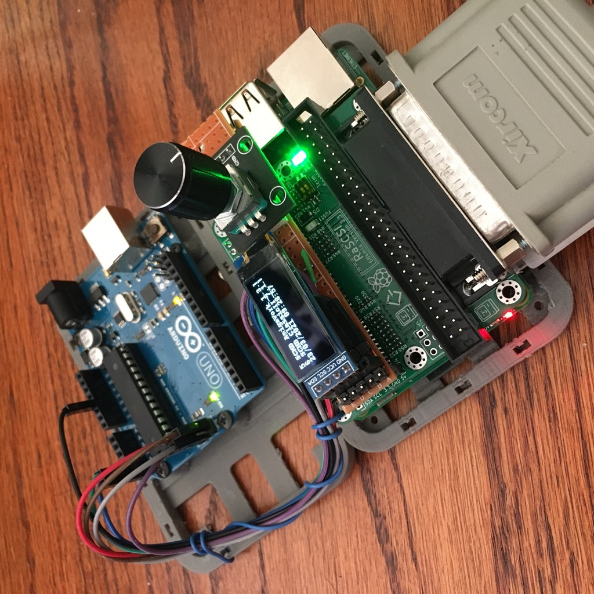

# I2C-Rotary-Encoder
A simple arduino script to put a rotary encoder on the I2C bus.

I created this so that I could noodle around with making a 
user interface for the [RaSCSI](https://github.com/akuker/RASCSI)
project, so that the OLED display it has could do more than just 
show the current values.

I'm using a standard rotary encoder board that I had leftover from
my Pi1541 and Gotek drive modifications.

# Connecting

Currently, this is only setup out of the box to work with a
standard Arduino Uno or other Arduino with an ATmega328 or
ATmega168 micro.

Encoder to Arduino

	Encoder     Arduino Pin
     SW          A0
     DT          A1
	 CLK         A2
	 +           +5V
	 GND         Ground

Arduino to Raspberry Pi

	RasPi       Arduino Uno Pin	
	 SDA         A4
	 SCL         A5
	 5V          +5v
	 GND         GND

Note that other Arduinos and micros (Leonardo/32u4, Mega, etc)
will likely require different wirings to connect to the I2C bus 
SDA and SCL pins.

# Pi Software Setup

If you already have done the setup for the RaSCSI 'oled_monitor', 
then you are good to go.  In short you need to enable the I2C 
interface, and get the i2C tools and such.

If you need to do this, I would recommend the software install
procedure [over at the RaSCSI project](
https://github.com/akuker/RASCSI/wiki/OLED-Status-Display-%28Optional%29#Software_Install).

# Trying it out

If you connect this up to your Raspberry Pi, it will appear on I2C
address 0x42.  This is changeable in the arduino source code.

To verify that it is connected:

    i2cdetect -y 1

You should see the knob at address 0x42.

         0  1  2  3  4  5  6  7  8  9  a  b  c  d  e  f
    00:          -- -- -- -- -- -- -- -- -- -- -- -- -- 
    10: -- -- -- -- -- -- -- -- -- -- -- -- -- -- -- -- 
    20: -- -- -- -- -- -- -- -- -- -- -- -- -- -- -- -- 
    30: -- -- -- -- -- -- -- -- -- -- -- -- 3c -- -- -- 
    40: -- -- 42 -- -- -- -- -- -- -- -- -- -- -- -- -- 
    50: -- -- -- -- -- -- -- -- -- -- -- -- -- -- -- -- 
    60: -- -- -- -- -- -- -- -- -- -- -- -- -- -- -- -- 
    70: -- -- -- -- -- -- -- --  

If you do, you can hit the 6 registers to read the values...

Remember that the high bit will be set on the data byte returned,
so if you read the address out of register 0, it will respond with
0xC2, even though the address is 0x42. For sanity, the rest of this 
doc will just ignore that 0x80 bit.

There is a script "example.py" in the Python folder that will
read the rotation delta (register 3), and button clicks (registers 5 and 4) 
so you can see how to talk with it.

# Registers

The device has 6 registers that can be read using standard I2C 
procedures.  Anything outside of this range is undefined.

| Register | Name | Description |
| --- | --- | --- |
| 0 | I2C Address | Returns the I2C address of the device (0x42) |
| 1 | Version | Returns 'S' (0x53) |
| 2 | Version | Returns 'L' (0x4C) |
| 3 | Button Pressing | Returns 1 if button is pressed, 0 if not |
| 4 | Button Press Count | Returns # of press-releases since last read |
| 5 | Encoder Delta CW | Returns # clockwise clicks since last read |
| 6 | Encoder Delta ACW | Returns # anticlockwise clicks since last read |

## Register 0 - I2C Address

Register 0 always returns the I2C address, which by default
is 0x42.  Any register reads greater than 5 (invalid register
address) will also return this value. 

    i2cget -y 1 0x42 0

## Register 1,2 - Version Sentinels

Registers 1 and 2 will always respond with an 'S'(0x53) and an 
'L' (0x4C) respectively for the initial software version.

    i2cget -y 1 0x42 1
    i2cget -y 1 0x42 2

## Register 3 - Button Is Being Pressed

A value of 0x01 indicates that the encoder button is currently
being pressed.  A value of 0x00 indicates it is not currently 
being pressed.

    i2cget -y 1 0x42 3

## Register 4 - Button Press Accumulator

This will return the number of times that the button was pressed, 
and then released since the last time it was called. That is to 
say that it
automatically clears the value when you read it, giving just 
the number of press-cycles since the previous call.

    i2cget -y 1 0x42 4

## Register 5,6 - Rotary Encoder Delta CW/ACW

These return the number of clicks rotated
since the last time it was called.  That is to say that it
automatically clears the value when you read it, giving just 
the number of clicks since the previous call.

Clockwise movements will be returned from register 6, and 
anticlockwise movements will be returned from register 5.

To get the full number of clicks since the last read:

    (Read Register 5) - (Read Register 6)

    i2cget -y 1 0x42 5
    i2cget -y 1 0x42 6

